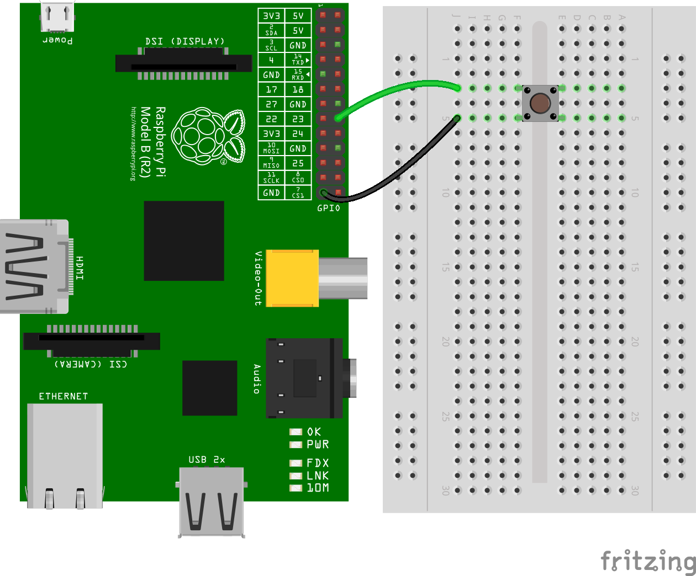

[](https://www.npmjs.com/package/pigpio)
[](https://www.npmjs.com/package/pigpio)
[](https://github.com/sindresorhus/awesome-nodejs)

# pigpio

A wrapper for the [pigpio C library](https://github.com/joan2937/pigpio) to
enable fast GPIO, PWM, servo control, state change notification and interrupt
handling with **Node.js** on the Raspberry Pi Zero, 1, 2, 3 or 4.

**At the moment both the pigpio Node.js module and the pigpio C library are
experimental on the Raspberry Pi 4 Model B.**

pigpio supports Node.js versions 6, 8, 10 and 12.

## Contents

 * [News & Updates](#news--updates)
 * [Features](#features)
 * [Installation](#installation)
 * [Usage](#usage)
   * [Pulse an LED with PWM](#pulse-an-led-with-pwm)
   * [Buttons and Interrupt Handling](#buttons-and-interrupt-handling)
   * [Servo Control](#servo-control)
   * [Measure Distance with a HC-SR04 Ultrasonic Sensor](#measure-distance-with-a-hc-sr04-ultrasonic-sensor)
   * [Determine the Width of a Pulse with Alerts](#determine-the-width-of-a-pulse-with-alerts)
   * [Debounce a Button](#debounce-a-button)
 * [API Documentation](#api-documentation)
 * [Limitations](#limitations)
 * [Troubleshooting](#troubleshooting)
 * [Related Packages](#related-packages)

## News & Updates

### September 2019: pigpio v2.0.0

pigpio v2.0.0 adds experimental support for the Raspberry Pi 4 Model B. Adding
this support has resulted in a number of changes related to hardware PWM.
These changes are specific to the Raspberry Pi 4 Model B. There have been no
changes for the Raspberry Pi Zero, 1, 2 or 3. For further details see
[hardwarePwmWrite](https://github.com/fivdi/pigpio/blob/master/doc/gpio.md#hardwarepwmwritefrequency-dutycycle) and
[getPwmRealRange](https://github.com/fivdi/pigpio/blob/master/doc/gpio.md#getpwmrealrange).

## Features

 * Digital IO
   * Up to 3.5 million digital reads per second <sup>*)</sup>
   * Up to 2.5 million digital writes per second <sup>*)</sup>
 * PWM on any of GPIOs 0 through 31
   * Multiple frequencies and duty cycle ranges supported
 * Servo control on any of GPIOs 0 through 31
   * Jitter free
 * Alerts when any of GPIOs 0 through 31 change state
   * The time of the state change is available accurate to a few microseconds
 * Notification streams for monitoring state changes on any of GPIOs 0 through 31 concurrently
   * The time of the state changes are available accurate to a few microseconds
 * Low latency interrupt handlers
   * Handle up to 20000 interrupts per second <sup>*)</sup>
 * Read or write up to 32 GPIOs as one operation with banked GPIO
 * Trigger pulse generation
 * Pull up/down resistor configuration

*) On a Raspberry Pi 4 Model B running Raspbian Buster 2019-07-10 with pigpio
v2.0.0, Node.js v12.10.0 and V70 of the pigpio C library.

## Installation

#### Step 1 - Install the pigpio C library

The [pigpio C library](https://github.com/joan2937/pigpio) is a prerequisite
for the pigpio Node.js module.

Run the following command to determine which version of the pigpio C library
is installed:

```
pigpiod -v
```

For the Raspberry Pi Zero, 1, 2 and 3 V41 or higher of the pigpio C library is
required. For the Raspberry Pi 4 V69 or higher is required.

If the pigpio C library is not installed or if the installed version is too
old, the latest version can be installed with the following commands:

```
sudo apt-get update
sudo apt-get install pigpio
```

Alternative installation instructions for the pigpio C library can be found
[here](http://abyz.me.uk/rpi/pigpio/download.html).

**Warning:** The pigpio C library contains a number of utilities. One of these
utilities is pigpiod which launches the pigpio C library as a daemon. This
utility should not be used as the pigpio Node.js package uses the C library
directly.

#### Step 2 - Install the pigpio Node.js package

```
npm install pigpio
```

## Usage

Assume there's an LED connected to GPIO17 (pin 11) and a momentary push button
connected to GPIO4 (pin 7).


#### Pulse an LED with PWM

Use PWM to pulse the LED connected to GPIO17 from fully off to fully on
continuously.

```js
const Gpio = require('pigpio').Gpio;

const led = new Gpio(17, {mode: Gpio.OUTPUT});

let dutyCycle = 0;

setInterval(() => {
  led.pwmWrite(dutyCycle);

  dutyCycle += 5;
  if (dutyCycle > 255) {
    dutyCycle = 0;
  }
}, 20);
```

#### Buttons and Interrupt Handling

Turn the LED connected to GPIO17 on when the momentary push button connected to
GPIO4 is pressed. Turn the LED off when the button is released.

```js
const Gpio = require('pigpio').Gpio;

const led = new Gpio(17, {mode: Gpio.OUTPUT});
const button = new Gpio(4, {
  mode: Gpio.INPUT,
  pullUpDown: Gpio.PUD_DOWN,
  edge: Gpio.EITHER_EDGE
});

button.on('interrupt', (level) => {
  led.digitalWrite(level);
});
```

#### Servo Control

Continuously move a servo connected to GPIO10 clockwise and anti-clockwise.


```js
const Gpio = require('pigpio').Gpio;

const motor = new Gpio(10, {mode: Gpio.OUTPUT});

let pulseWidth = 1000;
let increment = 100;

setInterval(() => {
  motor.servoWrite(pulseWidth);

  pulseWidth += increment;
  if (pulseWidth >= 2000) {
    increment = -100;
  } else if (pulseWidth <= 1000) {
    increment = 100;
  }
}, 1000);
```

#### Measure Distance with a HC-SR04 Ultrasonic Sensor

The `trigger` function can be used to generate a pulse on a GPIO and alerts can
be used to determine the time of a GPIO state change accurate to a few
microseconds. These two features can be combined to measure distance using a
HC-SR04 ultrasonic sensor.


```js
const Gpio = require('pigpio').Gpio;

// The number of microseconds it takes sound to travel 1cm at 20 degrees celcius
const MICROSECDONDS_PER_CM = 1e6/34321;

const trigger = new Gpio(23, {mode: Gpio.OUTPUT});
const echo = new Gpio(24, {mode: Gpio.INPUT, alert: true});

trigger.digitalWrite(0); // Make sure trigger is low

const watchHCSR04 = () => {
  let startTick;

  echo.on('alert', (level, tick) => {
    if (level == 1) {
      startTick = tick;
    } else {
      const endTick = tick;
      const diff = (endTick >> 0) - (startTick >> 0); // Unsigned 32 bit arithmetic
      console.log(diff / 2 / MICROSECDONDS_PER_CM);
    }
  });
};

watchHCSR04();

// Trigger a distance measurement once per second
setInterval(() => {
  trigger.trigger(10, 1); // Set trigger high for 10 microseconds
}, 1000);
```

#### Determine the Width of a Pulse with Alerts

Alerts can be used to determine the time of a GPIO state change accurate to a
few microseconds. Typically, alerts will be used for GPIO inputs but they can
also be used for outputs. In this example, the `trigger` method is used to
pulse the LED connected to GPIO17 on for 15 microseconds once per second.
Alerts are used to measure the length of the pulse.

```js
// Assumption: the LED is off when the program is started

const Gpio = require('pigpio').Gpio;

const led = new Gpio(17, {
  mode: Gpio.OUTPUT,
  alert: true
});

const watchLed = () => {
  let startTick;

  // Use alerts to determine how long the LED was turned on
  led.on('alert', (level, tick) => {
    if (level == 1) {
      startTick = tick;
    } else {
      const endTick = tick;
      const diff = (endTick >> 0) - (startTick >> 0); // Unsigned 32 bit arithmetic
      console.log(diff);
    }
  });
};

watchLed();

// Turn the LED on for 15 microseconds once per second
setInterval(() => {
  led.trigger(15, 1);
}, 1000);
```

Here's an example of the typical output to the console:

```
15
15
15
15
15
15
20
15
15
15
15
```

#### Debounce a Button
The GPIO glitch filter will prevent alert events from being emitted if the
corresponding level change is not stable for at least a specified number of
microseconds. This can be used to filter out unwanted noise from an input
signal. In this example, a glitch filter is applied to filter out the contact
bounce of a push button.



```js
const Gpio = require('pigpio').Gpio;

const button = new Gpio(23, {
  mode: Gpio.INPUT,
  pullUpDown: Gpio.PUD_UP,
  alert: true
});

let count = 0;

// Level must be stable for 10 ms before an alert event is emitted.
button.glitchFilter(10000);

button.on('alert', (level, tick) => {
  if (level === 0) {
    console.log(++count);
  }
});
```

## API Documentation

### Classes

- [Gpio](https://github.com/fivdi/pigpio/blob/master/doc/gpio.md) - General Purpose Input Output
- [GpioBank](https://github.com/fivdi/pigpio/blob/master/doc/gpiobank.md) - Banked General Purpose Input Output
- [Notifier](https://github.com/fivdi/pigpio/blob/master/doc/notifier.md) - Notification Stream

### pigpio Module

- [Global](https://github.com/fivdi/pigpio/blob/master/doc/global.md) - Module Globals

### Configuring pigpio

- [Configuration](https://github.com/fivdi/pigpio/blob/master/doc/configuration.md) - pigpio configuration

## Limitations

 * The pigpio Node.js package is a wrapper for the
   [pigpio C library](https://github.com/joan2937/pigpio). A limitation of the
   pigpio C library is that it can only be used by a single running process.
 * The pigpio C library and therefore the pigpio Node.js package requires
   root/sudo privileges to access hardware peripherals.
   
## Troubleshooting
If you have a problem with the library, before you remove it from your code and start trying something else, please check the [troubleshooting page](https://github.com/fivdi/pigpio/blob/master/doc/troubleshooting.md) first. Some problems are solvable and documented.

## Related Packages

Here are a few links to other hardware specific Node.js packages that may be of interest.

- [onoff](https://github.com/fivdi/onoff) - GPIO access and interrupt detection
- [i2c-bus](https://github.com/fivdi/i2c-bus) - I2C serial bus access
- [spi-device](https://github.com/fivdi/spi-device) - SPI serial bus access
- [mcp-spi-adc](https://github.com/fivdi/mcp-spi-adc) - Analog to digital conversion with the MCP3002/4/8, MCP3202/4/8 and MCP3304
- [pigpio-dht](https://github.com/depuits/pigpio-dht) - Implements logic to read DHT11 or DHT22/AM2302 temperature and relative humidity sensor
- [pigpio-mock](https://github.com/deepsyx/pigpio-mock) - A pigpio mock library for development on your local machine

